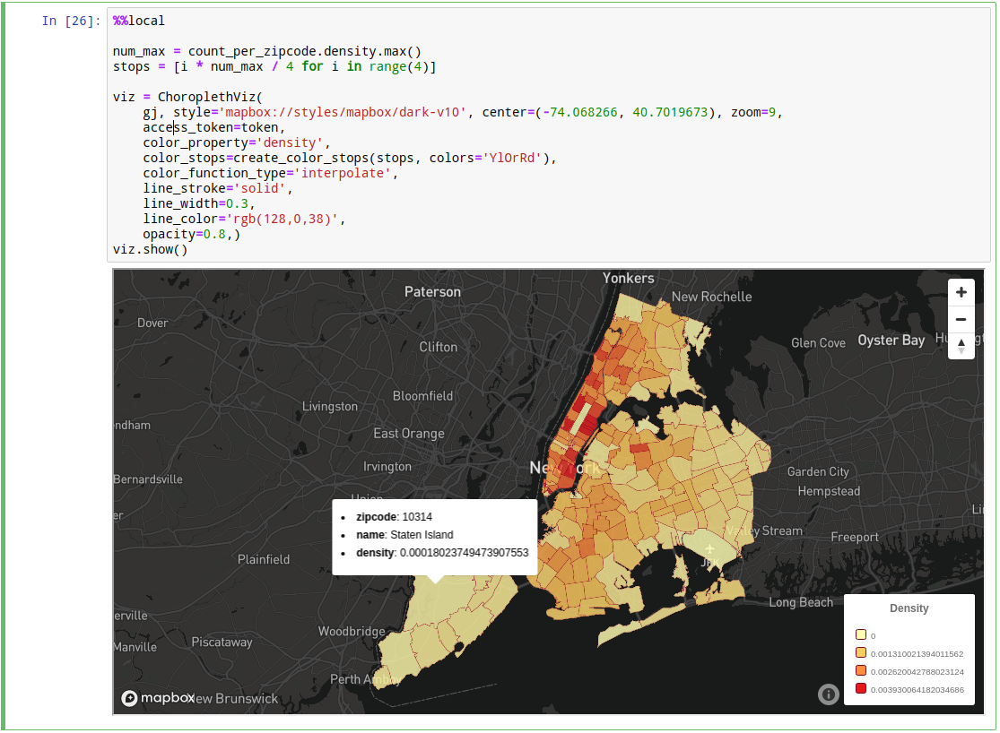

  <h1>kamu</h1>
  

    <strong>World's first decentralized data warehouse, on your laptop</strong>
  

  

  

- [About](#about)
- [Learning Materials](#learning-materials)
- [Documentation Index](#documentation-index)
- [Features](#features)
- [Project Status Disclaimer](#project-status-disclaimer)

## About

`kamu` is a command-line tool for managing and transforming structured data. 

In short it can be described as:
* Git for data (think collaboration)
* Distributed data warehouse
* Decentralized stream-processing data pipeline
* A supply chain for structured data
* Blockchain for Big Data
* Or even Kubernetes for data :)

Following the "**data as code**" philosophy it lets you build arbitrarily complex data pipelines. First, you define where to get data from and how to ingest it, and the tool will **keep datasets always up-to-date**. You can then **create derivative datasets** by joining or transforming other data - you write an **SQL query** and the tool will take care of updating derivative data as input datasets get new data. 

All datasets can be easily shared with others, creating a decentralized data pipeline, where all data by design is **reproducible**, **verifiable** and maintains a complete **provenance** trail. In the spirit of Open-Source Software it lets you collaborate with people you don't necessarily know, but still be certain that data is trustworthy.

`kamu` is a reference implementation of [Open Data Fabric](https://github.com/kamu-data/open-data-fabric) - a **Web 3.0 technology** for providing timely, high-quality, and verifiable data for data science, smart contracts, web and applications.

## Learning Materials

- [Kamu Blog: Introducing Open Data Fabric](https://www.kamu.dev/blog/introducing-odf/) - a casual introduction.
- [Kamu 101 - First Steps](http://www.youtube.com/watch?v=UpT2tvf3r0Y) - a video overview of key features.
- [Open Data Fabric for Research Data Management](https://www.youtube.com/watch?v=Ivh-YDDmRf8) - talk about motivation and system's design.
- [Open Data Fabric protocol specification](https://github.com/kamu-data/open-data-fabric) - technical overview and many gory details.
- [Building a Distributed Collaborative Data Pipeline](https://databricks.com/session_eu20/building-a-distributed-collaborative-data-pipeline-with-apache-spark) - technical talk from **Data+AI Summit 2020**

## Documentation Index

> Our documentation is still evolving, so many topics (those without links) have not been covered yet. Answers to most questions around theory, however, can be found in the [ODF specification](https://github.com/kamu-data/open-data-fabric)

- **[Installation](docs/install.md)**
- **[First Steps](docs/first_steps.md)**
- **Examples**
  - **[Currency Conversion](docs/examples/currency_conversion.md)** [temporal-table joins]
  - **[Stock Market Trading Data Analysis](docs/examples/trading.md)** [aggregations, temporal-table joins, watermarks, notebooks]
  - **[Overdue Order Shipments Detection](docs/examples/overdue_shipments.md)** [stream-to-stream joins, watermarks]
  - **[Housing Prices Analysis](docs/examples/housing_prices.md)** [GIS functions and joins, notebooks]
- **[Ingesting Data](docs/ingest.md)**
  - **[Merge Strategies](docs/merge_strategies.md)**
  - **[Ingestion Examples](docs/ingest_examples.md)**
- **Transforming Data**
  - Transformation model
  - Supported Engines
  - Projections
  - Streaming Aggregations
  - Temporal Table Joins
  - Stream-to-Stream Joins
  - Watermarks
  - Geo-Spatial Data
- **[Exploring Data](docs/exploring_data.md)**
- **[Sharing data](docs/sharing_data.md)**
  - **[Supported Repositories](docs/sharing_data.md#repository-types)**
  - **[Verifying Validity of Data](docs/sharing_data.md#validity-of-data)**
- **Exporting Data**
- **Dataset Evolution**
  - Schema Evolution
    - Adding / deprecating columns
    - Upstream schema changes
    - Backwards incompatible changes
  - Root Dataset Evolution
    - Handling source URL changes
    - Handling upstream format changes
  - Derivative Dataset Evolution
    - Handling upstream changes
    - Evolving transformations
- **Handling Bad Data**
  - Corrections and compensations
  - Bad data upon ingestion
  - Bad data in upstream datasets
  - PII and sensitive data
- **[Troubleshooting](docs/troubleshooting.md)**
- **Reference**
  - **[Manifest and Metadata Schemas](https://github.com/kamu-data/open-data-fabric/blob/master/open-data-fabric.md#metadata-reference)**
- **Contributing**
  - Contribution Guidelines
  - **[Developer Guide](docs/developer_guide.md)**

## Features

- **For Data Publishers**
  - Create and share your own dataset with the world
  - Ingest any existing data set from the web
  - Easily keep track of any updates to the data source in the future
  - Close the feedback loop and see who and how uses your data
    

- **For Data Professionals**
  - Collaborate on cleaning and improving data of existing datasets
  - Create derivative datasets by transforming, enriching, and summarizing data others have published
  - Write query once - run it forever with one of our state of the art stream processing engines
  - Always stay up-to-date by pulling latest updates from the data sources with just one command
  - Built-in support for GIS data

- **For Data Consumers**
  - Download a dataset from a shared repository
  - Easily verify that all data comes from trusted sources
  - Audit the chain of transformations this data went through
  - Validate that downloaded data was in fact produced by the declared transformations

- **For Data Exploration**
  - Explore data and run ad-hoc SQL queries (backed by the power of Apache Spark)
    
  - Launch a Jupyter notebook with one command
  - Join, filter, and shape your data using SQL
  - Visualize the result using your favorite library
    

## Project Status Disclaimer
`kamu` is an **alpha quality** software. Our main goal currently is to demonstrate the potential of the [Open Data Fabric](https://github.com/kamu-data/open-data-fabric) protocol and its transformative properties to the community and the industry and validate our ideas.

Naturally, we don't recommend using `kamu` for any critical tasks - it's definitely **not prod-ready**. We are, however absolutely delighted to use `kamu` for our personal data analytics needs and small projects, and hoping you will enjoy it too.

If you do - simply make sure to **maintain your source data separately** and don't rely on `kamu` for data storage. This way any time a new version comes out that breaks some compatibility you can simply delete your kamu workspace and re-create it from scratch in a matter of seconds.

Also, please **be patient with current performance** and resource usage. We fully realize that waiting 15s to process a few KiB of CSV isn't great. Stream processing technologies is a relatively new area, and the data processing engines `kamu` uses (e.g. Apache Spark and Flink) are tailored to run in large clusters, not on a laptop. They take a lot of resources to just boot up, so the start-stop-continue nature of `kamu`'s transformations is at odds with their design. We are hoping that the industry will recognize our use-case and expect to see a better support for it in future. We are committed to improving the performance significantly in the near future.
